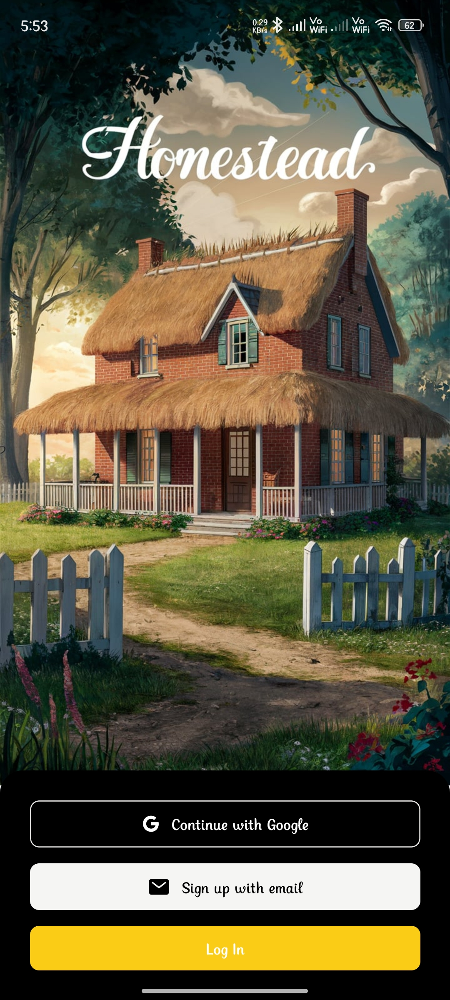
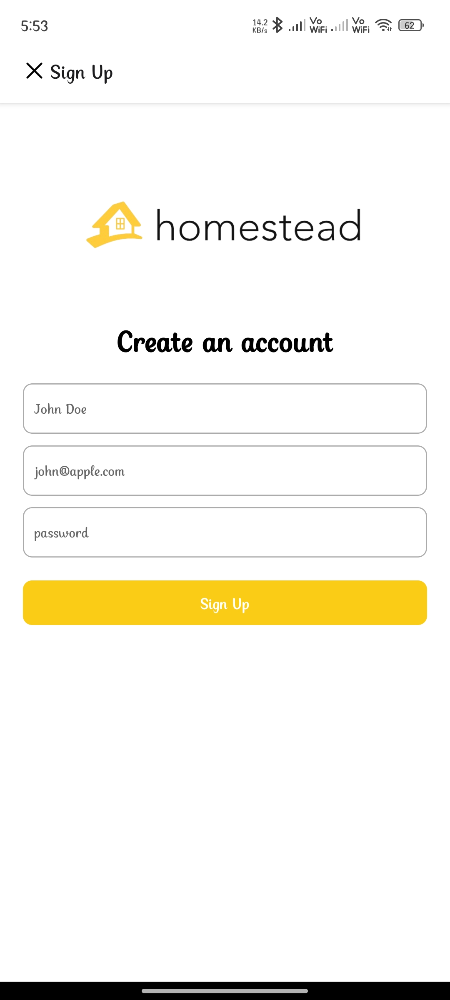
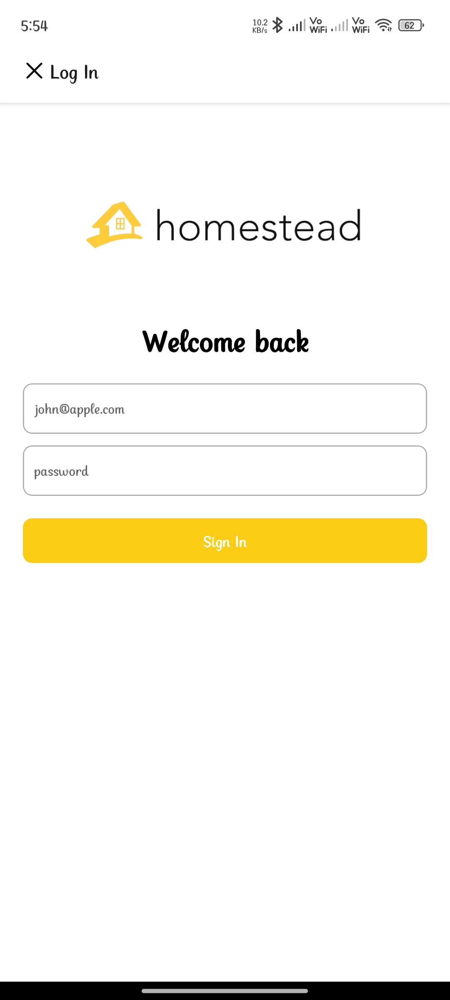
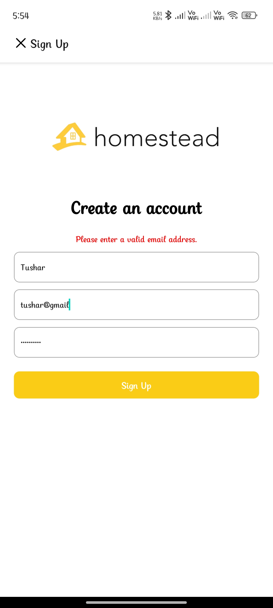
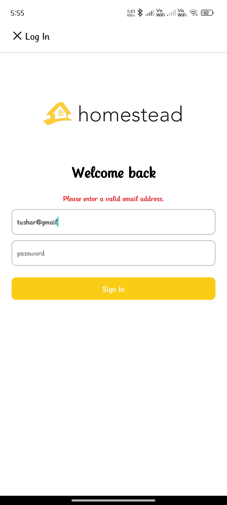
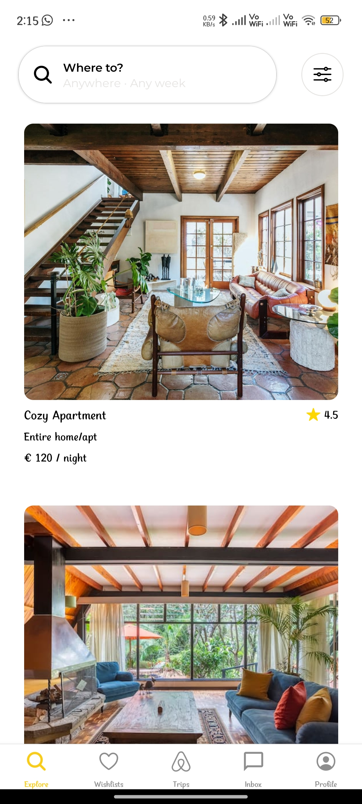
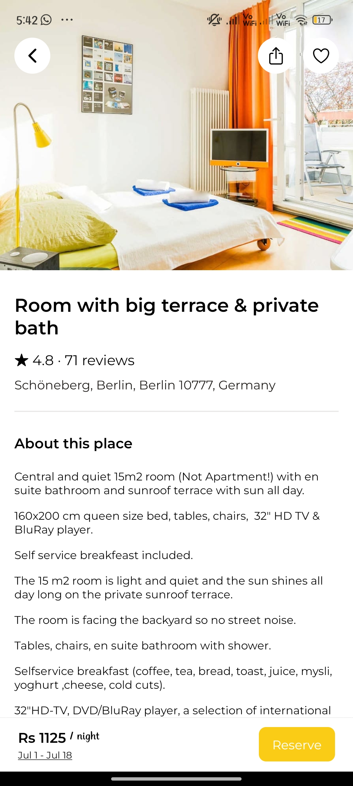
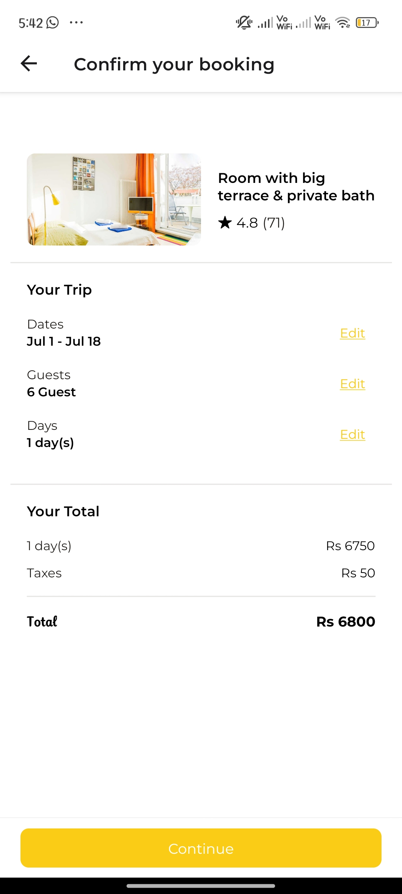
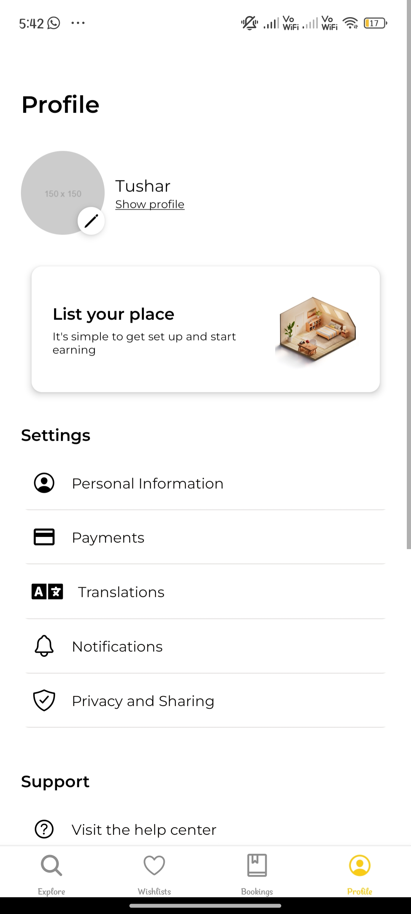
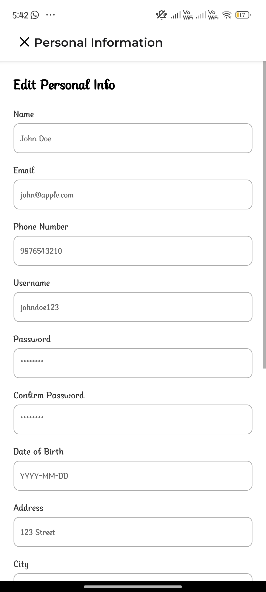

# Homestead App

Homestead is a mobile application built with React Native that allows users to list, discover, and book accommodations.

Backend Code : https://github.com/tusharag6/homestead-api

## Screenshots

### Onboarding Screen



### Auth Screens

<div style="display: flex; flex-wrap: wrap">
  
  
  
  
</div>

### Explore Screens

<div style="display: flex; flex-wrap: wrap;">
  
  
</div>

### Confirm Booking

<div style="display: flex; flex-wrap: wrap;">
  
</div>

### Profile

<div style="display: flex; flex-wrap: wrap;">
  
    
</div>

## Installation

To run the project locally, follow these steps:

1. **Clone the repository:**

   ```sh
   git clone https://github.com/tusharag6/homestead.git
   cd homestead
   ```

2. **Install dependencies:**

   ```sh
   npm install
   ```

3. **Run the application:**

   ```sh
   npm start
   ```
